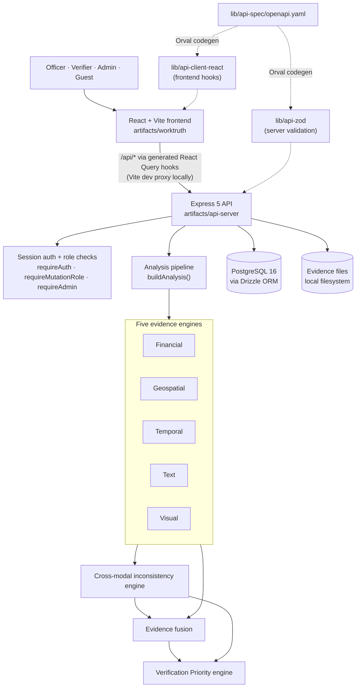
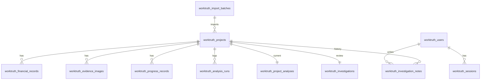

# WorkTruth — Evidence Verification & Verification Prioritization Platform


WorkTruth is a prototype platform for monitoring **MPLADS** (Members of Parliament Local Area Development Scheme) works. The evidence for a single public-works project is usually spread across separate places: sanction and expenditure figures, site photographs, GPS coordinates, progress reports and written descriptions. Nobody checks them against each other as a matter of routine. WorkTruth brings that evidence into one record. It runs five independent analysis engines (financial, geospatial, temporal, text and visual) and then looks for inconsistencies *between* the evidence types. From that it produces an explainable **Verification Priority** of **LOW**, **MODERATE**, **HIGH** or **CRITICAL**. The priority tells an officer where to look first. It is not a verdict. **Every decision stays with the human officer who reviews the evidence.**

> WorkTruth is a decision-support and verification-prioritization system. A high verification priority is not proof of fraud or wrongdoing.

---

## Table of Contents

- [Problem Statement](#problem-statement)
- [Solution](#solution)
- [Key Features](#key-features)
- [Five Analysis Engines](#five-analysis-engines)
- [Cross-Modal Evidence Fusion](#cross-modal-evidence-fusion)
- [Verification Priority](#verification-priority)
- [How WorkTruth Works](#how-worktruth-works)
- [System Architecture](#system-architecture)
- [Technology Stack](#technology-stack)
- [Repository Structure](#repository-structure)
- [Database / Data Model](#database--data-model)
- [API](#api)
- [Evidence Storage](#evidence-storage)
- [Authentication](#authentication)
- [Seed Data / Demo Mode](#seed-data--demo-mode)
- [Local Setup](#local-setup)
- [Environment Variables](#environment-variables)
- [Available Commands](#available-commands)
- [Testing & Validation](#testing--validation)
- [Architecture Decisions](#architecture-decisions)
- [Security & Safety Considerations](#security--safety-considerations)
- [Limitations](#limitations)
- [SIH Relevance](#sih-relevance)
- [Demo Flow](#demo-flow)
- [Product / User Capabilities](#product--user-capabilities)
- [Future Scope](#future-scope)
- [License](#license)

---

## Problem Statement

A constituency's MPLADS portfolio can hold many small works: community halls, roads, schools, water and sanitation facilities. The evidence that a given work was really delivered as recorded is fragmented:

- **Financial records** give the sanctioned amount, the expenditure and the dates of payments.
- **Photographs** are submitted as proof of work, sometimes with GPS and capture-time metadata and sometimes without.
- **Location data** is the project's declared coordinates.
- **Progress reports** are percentages reported over time.
- **Text** is the description of the work and its declared category.

Each source may look fine on its own. Problems usually show up only when they are compared with each other. Examples include money spent before the sanction date, a photograph that was already submitted for a different project, a photo whose GPS is kilometres from the declared site, or almost all of the money spent while progress is still at 28%. Doing these cross-checks by hand for every project doesn't scale. Without a systematic method, officers can't tell which projects most need a closer look.

What's needed is **evidence-based prioritization**. Every flag should point to the specific records that caused it. The system should report missing evidence as missing, rather than as suspicious. Judgement should stay with the responsible authority, not with an automated accusation.

## Solution

WorkTruth treats each project as a bundle of evidence and passes it through a one-way pipeline:

```text
Project evidence
  → Five individual analysis engines (financial · geospatial · temporal · text · visual)
  → Cross-modal inconsistency detection
  → Evidence fusion (confidence-weighted, coverage-aware)
  → Verification Priority (LOW / MODERATE / HIGH / CRITICAL) + "why" trail
  → Human officer review (status, notes, decision, audit trail)
```

All analysis is **deterministic and rule-based or statistical**. No external AI service and no machine-learning model is involved. Each check reports its severity, its observed values and the IDs of the records that triggered it, so any priority can be traced back to concrete evidence. The platform ranks the verification queue and explains why each project is placed where it is. It does not close cases, and it does not decide whether anything went wrong.

## Key Features

| Feature | How it works in the current implementation |
|---|---|
| **Monitoring dashboard** | Shows the total number of projects, how many need verification (HIGH + CRITICAL), average evidence quality, the CRITICAL count, the priority distribution, a category breakdown, per-signal anomaly counts and a recent-activity feed built from the append-only analysis-run log. |
| **Verification queue** | Lists projects ranked by computed priority band, then by fusion score within each band. You can search by ID, name or location, filter by priority, district and category, and sort by priority, evidence quality or financial ratio. |
| **Project detail / investigation page** | Shows project facts, the Verification Priority card with confidence, a per-lens breakdown and the "why" trail, the *Five lenses on the record*, a cross-project photo-match panel, a cost-benchmark chart, the evidence gallery, progress records, the evidence-fusion and cross-evidence-findings panels, and the officer workflow. |
| **Evidence management** | Upload JPEG, PNG or WebP images (up to 10 MB) to a project, then view or delete them. On upload the server extracts the SHA-256 hash, the perceptual hash, image dimensions and EXIF GPS and capture time. Dated progress reports can be added to a project. |
| **Register import** | Import a CSV or XLSX register (parsed in the browser with SheetJS). Headers are mapped to the expected fields and rows are validated on the client. The server then re-validates each row with Zod, rejects duplicate IDs, and records an import batch with accepted and rejected counts and per-row errors. |
| **Manual project creation** | The *Add project* form creates a project and runs the full analysis on it straight away. |
| **Five analysis engines** | Financial, geospatial, temporal, text and visual engines. See [below](#five-analysis-engines). |
| **Cross-modal inconsistency detection** | Seven rule types compare *different* evidence types, for example pre-sanction spending confirmed by both the financial and temporal engines, or a duplicate image that is GPS-tagged at two different locations. |
| **Evidence fusion** | Combines the five lens scores using confidence-weighted, renormalized weights. It measures evidence coverage, gives a bonus when independent lenses agree, and applies a penalty when the evidence is mixed. |
| **Verification Priority** | A documented rule set places each project in LOW, MODERATE, HIGH or CRITICAL. Each result comes with a recommendation, a primary finding and a structured "why" trail. |
| **Human review workflow** | Review status (*Pending Review*, *Under Investigation*, *Needs Field Visit*, *Verified*, *Resolved*), officer notes and a decision. Every update is appended to an investigation history that records the officer's name and a timestamp. |
| **Re-run analysis** | Recomputes a project's analysis on demand. Each run is stored in an append-only history. `pnpm db:reanalyze` does the same for every project. |
| **Project atlas (map)** | A schematic SVG map with markers placed by latitude and longitude and coloured by priority. Selecting a marker shows the project's priority and primary finding. |
| **Evidence analytics** | Portfolio-level views: category mix, a count of projects per anomalous signal, and spend against progress. |
| **Authentication & roles** | Database-backed sessions and scrypt password hashing. ADMIN, OFFICER, VERIFIER, VIEWER and GUEST roles are enforced on the server. Admins get a user-management page. |
| **Read-only guest demo** | *Explore demo* on the login page opens a session for a shared GUEST account that can't change anything. |
| **Demo data labelling** | Seeded rows carry `source: "seed_demo"`. Every authenticated page shows a *DEMO DATA · NOT OFFICIAL GOVERNMENT RECORDS* banner. |
| **OpenAPI-driven contracts** | A single `openapi.yaml` generates the Zod validators used by the server and the React Query hooks used by the frontend, through Orval. |

---

## Five Analysis Engines

All five engines live in `artifacts/api-server/src/lib/*-engine.ts`. Each is a pure evaluation function with a thin database I/O wrapper around it. All of them follow the same scoring convention:

- Each triggered check has a severity: `INFO` = 0, `LOW` = 0.1, `MODERATE` = 0.25, `HIGH` = 0.5.
- A lens score (0–1) is built from these weights, capped at 1.
- A score of **≥ 0.35** marks the lens as anomalous.
- **Confidence** is reported separately from the score. It measures how much evidence supports the assessment, not how alarming the result is.
- When there isn't enough evidence to assess a lens, it reports `INSUFFICIENT_EVIDENCE` and is left out of the fusion step. Missing evidence is never scored as an anomaly.

All thresholds are documented constants in the source. They are **heuristics, not statistically calibrated values**.

### 1. Financial Engine (`financial-engine.ts`)

This engine is rule-based and uses robust statistics.

- **Inputs:** the project's sanction and expenditure figures, its itemized ledger (`SANCTION`, `EXPENDITURE` and `PAYMENT` records), and a peer group. The peer group is the same category in the same district, falling back to the same category alone if there are fewer than 3 peers.
- **Evidence level:** `DETAILED` when a ledger exists, `BASIC` when only the summary figures exist, `NONE` otherwise.
- **Checks:**
  - ledger totals that don't reconcile with the recorded sanction or expenditure
  - duplicate ledger entries with the same type, amount and date
  - payments that exceed expenditure
  - a single payment making up more than 80% of all payments
  - expenditure or payments dated before the earliest sanction
  - expenditure above the sanction (HIGH if more than 25% over)
  - a sanction at ≥ 1.5× (MODERATE) or ≥ 2× (HIGH) the peer-group median sanction
  - an expenditure-to-sanction ratio at or above the 95th percentile of peers, or at or below the 5th
- **Score:** the larger of the rule component and a peer-deviation component, where the peer-deviation component is a MAD-based robust z-score that saturates at 5.
- **Outputs:** status (`WITHIN_EXPECTED_RANGE` or `ANOMALY_DETECTED`), score, confidence, the expenditure ratio, peer-group statistics (median, mean, standard deviation, MAD, percentile rank, median sanction, cost ratio), checks with supporting record IDs, and plain-language reasons.

### 2. Geospatial Engine (`geo-engine.ts`)

This engine is rule-based.

- **Inputs:** the project's declared latitude and longitude, and the GPS coordinates of each evidence image (from EXIF, or seed-authored for demo rows).
- **Validation:** it checks the declared coordinates and each image's coordinates for range. Images with no GPS are counted as missing, not treated as anomalous.
- **Distance:** the Haversine distance from each image to the declared site, summarized as minimum, median and maximum.
- **Checks:**
  - a median distance of more than 200 m (MODERATE) or more than 1 km (HIGH)
  - images that are more than 200 m (MODERATE) or more than 1 km (HIGH) apart from *each other*
  - malformed GPS metadata
- **Score:** the larger of distance ÷ 2 km and pairwise spread ÷ 2 km, capped at 1.
- **Outputs:** status (`LOCATION_CONSISTENT` or `LOCATION_ANOMALY`), per-image points with their distances, counts of valid, missing and invalid GPS, and reasons.

### 3. Temporal Engine (`temporal-engine.ts`)

This engine is rule-based.

- **Inputs:** the project's start, expected-completion and actual-completion dates, dated progress reports, dated financial records, and image capture times. Capture time comes from EXIF and is never the upload time.
- **Checks:**
  - a start date after the expected completion date, or a completion date before the start
  - future-dated evidence
  - invalid dates
  - conflicting or duplicate progress reports on the same day
  - progress that decreases (LOW, MODERATE or HIGH by size of the drop)
  - a jump of ≥ 40 percentage points within ≤ 3 days
  - spending dated before the sanction, before the project start, or after completion
  - images captured before the start or after completion
- **Outputs:** status (`TEMPORALLY_CONSISTENT` or `TEMPORAL_ANOMALY`), the first and last event dates, the progress change and rate per day, checks and reasons.

### 4. Text Engine (`text-engine.ts`)

This engine uses deterministic TF-IDF. It uses **no NLP model and no embeddings**. The engine reports its own method as *"TF-IDF cosine similarity (deterministic token statistics, no ML model)"*.

- **Processing:** lower-casing, removal of non-alphanumeric characters, removal of stop-words, then smoothed-IDF TF-IDF vectors compared by cosine similarity against peer-project descriptions.
- **Checks:**
  - a very short description (fewer than 4 meaningful tokens)
  - category and description consistency, using a small documented keyword list per category (for example *Road* → road, culvert, bridge and similar)
  - an exact duplicate of another project's description (HIGH)
  - a highly similar description: cosine ≥ 0.5 is MODERATE, ≥ 0.75 is HIGH
- **Outputs:** status (`CONSISTENT`, `POTENTIALLY_INCONSISTENT` or `REQUIRES_VERIFICATION`), the top three most similar peers with similarity scores, the category keyword match count, and the method string.

### 5. Visual Engine (`visual-engine.ts`)

This engine uses cryptographic and perceptual hashing. It has **no object or content recognition**: it can't tell what an image shows or estimate construction progress from pixels.

- **Image processing** (`image-processing.ts`) uses:
  - SHA-256 for byte-identical files
  - jimp's 64-bit perceptual hash (32×32 greyscale → DCT → 8×8 low-frequency coefficients)
  - EXIF capture date and GPS, read with `exifr`
- **Checks:**
  - exact duplicate files within the project (HIGH)
  - perceptual near-duplicates, meaning a Hamming distance of ≤ 8 out of 64 bits (MODERATE)
  - identical or near-identical images captured on *different* dates, meaning no visible change between them (MODERATE)
  - **cross-project reuse** (HIGH): a photo that matches, exactly or perceptually, a photo submitted for a *different* project
- **Cross-project match output:** the matched project, the Hamming distance, the number of hash bits and the similarity percentage. All of these are computed from the stored hashes.
- **Outputs:** status (`CONSISTENT` or `REQUIRES_VERIFICATION`), image, dated and undated counts, the capture-date range, and checks.

---

## Cross-Modal Evidence Fusion

Two separate modules combine what the five engines report.

```text
Financial evidence ─┐
Location evidence  ─┤
Timeline evidence  ─┼─► Cross-modal inconsistency engine ─► Evidence fusion ─► Verification Priority
Text evidence      ─┤          (structured findings)          (evidence signal)
Image evidence     ─┘
```

Combining evidence helps because a single weak signal is often innocent. A photo may just have lost its GPS, or a description may be short. When evidence types that are *independent* of each other disagree, that is a much stronger reason for a person to take a look.

### Cross-modal inconsistency engine (`cross-modal-engine.ts`)

This engine produces structured inconsistency objects. Each one has a deterministic ID, the dimensions involved, a severity, a confidence, a description, references to the evidence (record and image IDs, field values), the supporting checks, the observed values and the relationship that was expected.

| Rule | Dimensions | Condition | Severity |
|---|---|---|---|
| Activity before sanction | financial + temporal | *Both* engines independently flag expenditure or payments dated before the earliest sanction | HIGH; **CRITICAL** if the pre-sanction amount is ≥ 25% of the sanctioned total |
| Activity before start | financial + temporal | Spending dated before the project's start date | Inherited (MODERATE) |
| Activity after completion | financial + temporal | Spending dated after the recorded completion date | Inherited (HIGH) |
| Reused image, different location | geospatial + visual | Duplicate or near-duplicate images whose GPS tags are more than 200 m apart | HIGH (exact) / MODERATE (near) |
| No visual change across dates | visual + temporal | Near-identical images captured on different dates | Inherited (MODERATE) |
| Spend vs. progress mismatch | financial + temporal | ≥ 85% of the sanction spent while latest progress is ≤ 30% (HIGH); or ≤ 15% spent while progress is ≥ 90% (MODERATE) | HIGH / MODERATE |
| Description / category mismatch | text + category | The description contains none of the keywords for its declared category | LOW |

The same fact can be reported by two engines. For example, pre-sanction spending is flagged by both the financial and temporal engines. A shared correlated-check registry makes sure it produces **one** inconsistency and is counted **once** in fusion. A rule that compares geospatial and temporal evidence directly is deliberately **not** implemented, because the current schema has no reliable "project stage" field for it to use.

### Evidence fusion (`fusion-engine.ts`)

- **Default lens weights** (heuristic, and defined in only one place): financial 0.25, geospatial 0.20, temporal 0.20, text 0.15, visual 0.20.
- **Effective weight:** each available lens gets its weight × its confidence, renormalized across the available lenses. Lenses with insufficient evidence are left out rather than counted as zero.
- **Base score:** the weighted average of the available lens scores.
- **Agreement bonus:** +0.08 for each additional *independent* anomalous lens, up to a maximum of +0.20. Correlated checks are counted once.
- **Mixed evidence:** when some lenses are anomalous and others are consistent, confidence is reduced by 0.05.
- **Coverage status:** `INSUFFICIENT_EVIDENCE`, `LIMITED_EVIDENCE`, `SUFFICIENT_EVIDENCE` or `STRONG_EVIDENCE`, based on how much of the configured weight is backed by evidence and how confident that evidence is.
- Cross-modal inconsistencies appear in the fusion explanation for context. They are **not** added into the fusion score, which avoids counting the same fact twice.

The fusion score is an evidence signal from 0 to 1. **It is not a probability of fraud.**

---

## Verification Priority

Verification Priority represents how strongly the available evidence suggests that a project deserves additional human review. It is a way of routing attention, not a finding of wrongdoing.

`verification-priority-engine.ts` computes the priority **only** from the fusion output and the severity counts of the cross-modal inconsistencies. It never reads a project's identity or any stored priority column. The rules are checked in order, and the first one that matches decides the priority:

| Priority | Assigned when |
|---|---|
| **CRITICAL** | At least one CRITICAL cross-modal inconsistency exists |
| **HIGH** | Two or more HIGH inconsistencies; **or** one HIGH inconsistency and a fusion score ≥ 0.5; **or** a fusion score ≥ 0.5 with confidence ≥ 0.5 |
| **MODERATE** | A fusion score ≥ 0.2 with evidence coverage ≥ 0.4; **or** at least one MODERATE inconsistency |
| **LOW** | Everything else, including projects with **insufficient evidence**. These are labelled as such through low confidence and an explicit reason, and are never treated as anomalous |

Each result includes:

- `confidence`: the fusion confidence, unchanged. A project can be HIGH priority with moderate confidence.
- `recommendation`: a concrete next step matched to the type of inconsistency, for example *"Verify financial records and the sanction timeline first…"*
- `primaryFinding`: the single most important finding that is backed by evidence
- `why`: a structured trail in which every reason links to a cross-modal inconsistency, a triggered lens check or the coverage accounting, along with evidence references
- `drivers` and `methodology`: the inputs and the rule text, so an officer can challenge the result

---

## How WorkTruth Works

1. **A project record enters the platform.** This happens through the demo seed, the *Add project* form, or a CSV or XLSX register import.
2. **Financial evidence is recorded.** Sanction and expenditure figures become an itemized ledger. The demo hero case has its own dated ledger.
3. **Visual evidence is attached.** Officers upload site photographs. The server stores the file and extracts SHA-256, perceptual hash, dimensions and EXIF GPS and capture time.
4. **Progress evidence is added** as dated progress-report records.
5. **The five engines run.** Analysis runs automatically when a project is created or imported, and on demand through *Re-run analysis*. New images or progress reports feed into the result the next time analysis is re-run.
6. **Individual engines produce evidence signals.** Each gives a status, score, confidence, checks and reasons.
7. **Cross-modal rules compare the signals.** They look for inconsistencies between different evidence types.
8. **Fusion combines the lenses** into a confidence-weighted evidence signal with coverage and agreement accounting.
9. **A Verification Priority is assigned**, along with a recommendation, a primary finding and a why-trail.
10. **The result is stored.** It becomes the project's current analysis and is also appended to the analysis-run history.
11. **The verification queue is ranked.** CRITICAL projects come first, then HIGH, MODERATE and LOW, ordered by fusion score within each band.
12. **An officer reviews the evidence** on the project page and records a review status, notes and a decision. Each update is added to the audit trail. The officer decides whether further verification or action is needed.

---

## System Architecture



The pipeline runs in one direction only: lens outputs → cross-modal → fusion → priority. Nothing reads a priority back into an earlier stage.

---

## Technology Stack

| Layer | Technology (as used in this repository) |
|---|---|
| Frontend | React 19, Vite 7, Tailwind CSS 4, Radix UI primitives, wouter (routing), TanStack React Query 5, lucide-react icons |
| Spreadsheet import | SheetJS `xlsx` (CSV and XLSX parsed in the browser) |
| Backend | Node.js (≥ 22.9), Express 5, multer (multipart uploads), cookie-parser, cors, pino and pino-http (logging) |
| Image processing | jimp (decoding and perceptual hash), exifr (EXIF GPS and capture date), Node `crypto` (SHA-256) |
| Language | TypeScript 5.9 |
| Database | PostgreSQL 16 (`pg` driver) |
| ORM / schema | Drizzle ORM, drizzle-kit, drizzle-zod |
| Validation | Zod schemas generated from the OpenAPI spec (`@workspace/api-zod`) |
| API specification | OpenAPI 3.1 (`lib/api-spec/openapi.yaml`) |
| API code generation | Orval → React Query hooks and Zod schemas |
| Build | Vite (frontend), esbuild (API bundled to ESM), `tsc --build` for type-checking the libraries |
| Package manager | pnpm 10.4.1 workspaces (with `minimumReleaseAge` supply-chain protection) |
| Testing | Node's built-in test runner (`node:test`), run through `tsx --test` |
| Containerization | Docker Compose, for local PostgreSQL only |
| Deployment config | Vercel: `vercel.json` + `api/index.mjs` + [VERCEL_DEPLOYMENT.md](VERCEL_DEPLOYMENT.md) (frontend and API on one domain). Render: `render.yaml` Blueprint + [DEPLOYMENT.md](DEPLOYMENT.md) (free tier) |

---

## Repository Structure

```text
WorkTruth-Evidence-Platform/
├── artifacts/
│   ├── api-server/            # Express API, analysis engines, seed & maintenance scripts
│   │   └── src/
│   │       ├── routes/        # health.ts · worktruth.ts · admin.ts
│   │       ├── middlewares/   # auth.ts (requireAuth / requireMutationRole / requireAdmin)
│   │       ├── lib/           # *-engine.ts, auth, storage, image-processing, seed data, tests
│   │       ├── seed.ts        # pnpm db:seed
│   │       └── reanalyze.ts   # pnpm db:reanalyze
│   ├── worktruth/             # React + Vite frontend
│   │   ├── public/evidence/   # static hero-case demo photographs
│   │   └── src/               # App.tsx (routes), pages/, components/, lib/register-import.ts
│   └── mockup-sandbox/        # standalone UI design sandbox (not used by the app)
├── lib/
│   ├── api-spec/              # openapi.yaml + orval.config.ts
│   ├── api-zod/               # generated Zod schemas (do not hand-edit)
│   ├── api-client-react/      # generated React Query hooks + custom fetch
│   └── db/                    # Drizzle schema, SQL migrations, migrate script
├── api/index.mjs              # Vercel function entrypoint (re-exports the Express app)
├── scripts/                   # small utility workspace package
├── docker-compose.yml         # local PostgreSQL 16
├── vercel.json                # Vercel build, function and rewrite config
├── VERCEL_DEPLOYMENT.md       # Vercel deployment guide
├── render.yaml                # Render deployment Blueprint
├── DEPLOYMENT.md              # Render deployment guide
├── .env.example               # documented environment variables
├── pnpm-workspace.yaml
└── package.json
```

| Path | What lives there |
|---|---|
| `artifacts/api-server/src/lib/*-engine.ts` | The financial, geo, temporal, text, visual, cross-modal, fusion and verification-priority engines |
| `artifacts/api-server/src/lib/worktruth.ts` | `buildAnalysis()` orchestration, demo seed dataset, account provisioning, queue ordering |
| `artifacts/api-server/src/lib/hero-case.ts` | The synthetic end-to-end demo case (P-1089) |
| `artifacts/api-server/src/routes/` | All HTTP endpoints |
| `artifacts/worktruth/src/pages/worktruth-pages.tsx` | Landing, login, dashboard, queue, project detail, map, analytics, import, settings and user-management pages |
| `artifacts/worktruth/src/components/worktruth.tsx` | App shell, fusion and inconsistency panels, why-trail, visual-match panel and shared UI |
| `lib/db/src/schema/index.ts` | Source of truth for the database schema |
| `lib/api-spec/openapi.yaml` | Source of truth for the API contract |

---

## Database / Data Model

The schema is defined in [`lib/db/src/schema/index.ts`](lib/db/src/schema/index.ts). It has 11 tables, all prefixed `worktruth_`:

| Table | Purpose |
|---|---|
| `worktruth_users` | Accounts: email, name, role, `is_active` and scrypt `password_hash` |
| `worktruth_sessions` | Opaque session tokens with expiry, linked to a user (cascade on delete) |
| `worktruth_projects` | The project record: category, district, state, location, sanction, expenditure, progress, coordinates, dates, description, contractor, `source` provenance and import batch |
| `worktruth_financial_records` | Dated ledger entries of type `SANCTION`, `EXPENDITURE` or `PAYMENT` |
| `worktruth_evidence_images` | Image metadata: storage key, MIME type, size, dimensions, capture time, GPS, SHA-256, perceptual hash, label, source |
| `worktruth_progress_records` | Dated progress percentages with notes |
| `worktruth_project_analyses` | The *current* analysis payload for each project (JSONB) |
| `worktruth_analysis_runs` | An append-only history of every analysis run, with what triggered it |
| `worktruth_investigations` | The current review status, notes and decision for each project |
| `worktruth_investigation_notes` | The audit trail of review updates, with the officer's name and user ID |
| `worktruth_import_batches` | Register-import provenance: filename, accepted and rejected counts, quality score, row errors |



`worktruth_projects.priority` and `primary_flag` are **provenance-only** columns left over from the seed dataset. Nothing reads them for any computation. The priority and primary finding shown in the API and UI always come from the computed analysis.

Local development applies the schema with `pnpm db:push`. For hosted databases, the committed SQL migrations in `lib/db/drizzle/` are applied with `pnpm db:migrate` (see [VERCEL_DEPLOYMENT.md](VERCEL_DEPLOYMENT.md) or [DEPLOYMENT.md](DEPLOYMENT.md)).

---

## API

The API is an Express 5 application mounted at `/api`. The contract is defined in [`lib/api-spec/openapi.yaml`](lib/api-spec/openapi.yaml), and Orval generates two things from it:

- `@workspace/api-zod`: Zod schemas the server uses to validate request params and bodies and to parse responses
- `@workspace/api-client-react`: typed React Query hooks the frontend uses. Requests are sent with `credentials: "include"`.

Every route except `/healthz`, `/auth/login`, `/auth/guest` and `/auth/logout` requires a valid session. Routes that change data also require a role that can make changes. `/admin/*` requires ADMIN.

| Group | Endpoints |
|---|---|
| Health | `GET /healthz`: readiness check that includes a PostgreSQL `SELECT 1` |
| Auth | `POST /auth/login` · `POST /auth/guest` · `POST /auth/logout` · `GET /auth/session` |
| Dashboard | `GET /dashboard/stats` · `GET /dashboard/activity` |
| Projects | `GET /projects` (search, priority, district, category, sort, page, pageSize) · `POST /projects` · `GET /projects/{id}` · `PUT /projects/{id}` |
| Analysis | `GET /projects/{id}/analysis` · `POST /projects/{id}/analysis` (re-run) · `GET /projects/{id}/risk` · `GET /projects/{id}/financial-analysis` · `…/geo-analysis` · `…/temporal-analysis` · `…/text-analysis` · `…/visual-analysis` · `…/fusion-analysis` · `…/inconsistencies` |
| Evidence | `GET`/`POST /projects/{id}/images` · `GET`/`DELETE /projects/{id}/images/{imageId}` · `GET /projects/{id}/images/{imageId}/file` · `GET`/`POST /projects/{id}/progress` |
| Review | `GET`/`POST /projects/{id}/investigation` |
| Import | `POST /upload/projects` |
| Admin | `GET`/`POST /admin/users` · `PATCH /admin/users/{id}/status` · `PATCH /admin/users/{id}/role` |

Unknown `/api` paths return a JSON 404. Unhandled errors are logged on the server and return a generic JSON 500 with no stack trace.

To regenerate the clients after editing the spec, run `pnpm --filter @workspace/api-spec run codegen`. Never hand-edit the generated files.

---

## Evidence Storage

Evidence images are handled by [`artifacts/api-server/src/lib/storage.ts`](artifacts/api-server/src/lib/storage.ts) and the upload route.

- **Location:** stored on the local filesystem under `EVIDENCE_UPLOAD_DIR`. The default is `./uploads` relative to the API process, which is `artifacts/api-server/uploads`. This directory is gitignored.
- **Type restrictions:** only `image/jpeg`, `image/png` and `image/webp` are accepted.
- **Content check:** the file must actually decode as an image, or the upload is rejected with a 400.
- **Size limit:** 10 MB per file. Uploads are held in memory by multer and written to disk only after validation.
- **Server-generated filenames:** files are stored as `projects/<projectId>/<uuid>.<ext>`. The name the client supplied is kept as metadata only and never used in a path.
- **Path traversal protection:**
  - project IDs must match `^[A-Za-z0-9_-]+$`
  - extensions must match `^[a-z0-9]{2,5}$`
  - every storage key is resolved and rejected if it points outside the storage root
- **Access control:** files are served only through the authenticated `GET …/images/{imageId}/file` route, with `Cache-Control: private`. Deleting an image removes both its database row and its file.
- **Storage interface:** storage sits behind a small `EvidenceStorage` interface, so an object-storage backend could be added later. Local filesystem is currently the only implementation.
- **Development and demo behaviour:** seeded demo images are generated deterministically. If a seeded file is missing, it is regenerated byte-for-byte. The two hero-case photographs are served as static frontend assets from `artifacts/worktruth/public/evidence/`. A real officer upload that has gone missing returns 404.
- **Production:** point `EVIDENCE_UPLOAD_DIR` at a persistent volume. The API logs a warning when `NODE_ENV=production` and the variable is unset. The Render free-tier setup in `render.yaml` uses an **ephemeral** path, so uploads there are lost on restart (see [DEPLOYMENT.md](DEPLOYMENT.md)). On Vercel, where the function filesystem is read-only, uploads fall back to the per-instance OS temp directory, which is not persistent either (see [VERCEL_DEPLOYMENT.md](VERCEL_DEPLOYMENT.md)).

---

## Authentication

WorkTruth uses its own email and password login with **opaque, database-backed sessions**. It does **not** use OAuth or JWT, and there is no `SESSION_SECRET`.

**Passwords**
- Passwords are hashed with Node's `scrypt`, using a random 16-byte salt and a 64-byte key, and verified with `timingSafeEqual`.
- An unknown email is checked against a dummy hash, so response timing doesn't reveal whether an account exists.
- Disabled accounts get the same generic *"Invalid email or password"* message as a wrong password.

**Sessions**
- Each session is a 32-byte random token stored in `worktruth_sessions`, valid for 7 days, and carried in an `httpOnly` cookie named `worktruth_session`.
- The cookie uses `SameSite=Lax` locally. It switches to `SameSite=None; Secure` when `CORS_ORIGIN` is set, and is `Secure` whenever `NODE_ENV=production`.
- Logging out deletes the session row. Expired sessions and sessions of disabled accounts are rejected when next used.

**Accounts**
- **Development officer account:** there are no built-in credentials. `SEED_OFFICER_EMAIL`, `SEED_OFFICER_NAME` and `SEED_OFFICER_PASSWORD` in `.env` create an OFFICER account on `pnpm db:seed` or on the first API request. Provisioning is idempotent: if the configured password changes, only the password hash is rotated. If these variables are unset, no officer account exists and the API logs a warning at startup.
- **Optional first admin:** `SEED_ADMIN_*` creates an ADMIN account in the same way. The admin can then create other users from **Admin → User Management** (`/admin/users`).

**Roles** (enforced on the server)

| Role | Can do |
|---|---|
| ADMIN | Everything, plus user management |
| OFFICER / VERIFIER | Read everything, and make changes: create or import projects, upload and delete evidence, add progress reports, re-run analysis, record reviews. The two roles currently have the same permissions. |
| VIEWER | Read-only |
| GUEST | Read-only. Backs the shared *Explore demo* account. |

- **Read-only enforcement:** `requireMutationRole` returns a 403 to VIEWER and GUEST on every route that changes data.
- **Last-admin protection:** the admin API refuses to disable or demote the last active admin.
- **Frontend guards:** `RequireAuth` and `RequireAdmin` in the frontend only redirect the user for convenience. The actual access control is on the server.
- **Guest demo:** the GUEST account is created automatically with a random password that is never stored. Set `GUEST_DEMO_ENABLED=false` to turn it off.

---

## Seed Data / Demo Mode

`pnpm db:seed` runs the same idempotent logic that also runs on the first API request. If the projects table is empty, it creates **23 synthetic demo projects** across Uttar Pradesh districts, with categories including Community Hall, School, Road, Water, Sanitation and Public Facility.

- **Clearly marked as demo data.** Every seeded row has `source: "seed_demo"`, or `seed_demo_static` for the hero photographs. The UI shows a *DEMO DATA · NOT OFFICIAL GOVERNMENT RECORDS* banner. **None of this is real government data.**
- **Real evidence rows.** Each project gets its own financial-ledger rows and progress-report rows. All but the last two also get a synthetic site image with seed-authored GPS and capture date near the declared site. The last two are deliberately left without an image so that `INSUFFICIENT_EVIDENCE` handling can be seen.
- **The analysis is not hardcoded.** The engines compute every score, inconsistency and priority from the seeded rows, exactly as they would for real data. No project ID is special-cased in any engine.
- **The hero case (P-1089)** is a single synthetic project that exercises every lens:
  - a sanction far above the median of comparable community halls
  - an expenditure dated before the sanction
  - reported progress of 28% while almost all of the sanction has been spent
  - a description that is almost identical to project **P-3022**
  - a photograph that is a perceptual near-duplicate of P-3022's photograph and is GPS-tagged about 1.4 km from the declared site

  Under the documented rules, the pre-sanction expenditure (₹7,20,000 against a ₹27,00,000 sanction, about 27%) crosses the 25% threshold for a CRITICAL cross-modal inconsistency.
- **Demo data in production:** demo projects are **not** seeded when `NODE_ENV=production`, unless `SEED_DEMO_DATA=true` is set explicitly.

---

## Local Setup

### Requirements

- **Node.js 22.9+** (`.node-version` is `22`) and **pnpm** (the repo pins `pnpm@10.4.1`)
- **Docker Desktop**, for the local PostgreSQL 16 container, **or** an existing PostgreSQL 16+ instance of your own

### 1. Clone and install

```bash
git clone <this repository>
cd WorkTruth-Evidence-Platform
pnpm install
```

### 2. Configure the environment

```bash
cp .env.example .env
```

On Windows PowerShell:

```powershell
Copy-Item .env.example .env
```

The defaults in `.env.example` already match `docker-compose.yml`. The only values you must choose are the `SEED_OFFICER_*` login credentials (see [Authentication](#authentication)):

```env
SEED_OFFICER_EMAIL=you@example.com
SEED_OFFICER_NAME=Your Name
SEED_OFFICER_PASSWORD=pick-your-own-password
```

### 3. Start PostgreSQL, apply the schema, seed demo data

```bash
docker compose up -d --wait   # or: pnpm db:up
pnpm db:push                  # push the Drizzle schema to the database
pnpm db:seed                  # create the officer account + demo projects
```

`pnpm db:setup` runs `db:push` and `db:seed` together. Seeding is idempotent, and it also runs automatically on the first API request if you skip it. If you already run your own PostgreSQL, skip `docker compose` and point `DATABASE_URL` at your instance.

### 4. Run

```bash
pnpm dev
```

This runs the frontend and the API together.

| Service | URL |
|---|---|
| Frontend | http://localhost:5173 |
| API | http://localhost:5000 |
| Health check | http://localhost:5000/api/healthz (also verifies the database connection) |

Log in at http://localhost:5173 with the `SEED_OFFICER_*` credentials, or choose **Explore demo** for the read-only guest session.

> There is deliberately no `pnpm setup` script, because `setup` is a reserved pnpm subcommand. The equivalent one-time flow is `pnpm db:up && pnpm db:setup && pnpm dev`.

**Local development notes**
- The frontend and the API use different port variables on purpose (`WEB_PORT` and `PORT`), so `pnpm dev` can run both without a collision.
- In development, Vite proxies `/api/*` to the API (see `server.proxy` in `artifacts/worktruth/vite.config.ts`). The app always calls relative `/api/...` paths unless `VITE_API_BASE_URL` is set at build time.
- The API's `dev` script builds and then starts the server. It is not a watch mode, so restart it after editing API code.

---

## Environment Variables

These come from [`.env.example`](.env.example). Never commit a real `.env`.

| Variable | Required | Description |
|---|---|---|
| `DATABASE_URL` | **Yes** | PostgreSQL connection string. The example value matches `docker-compose.yml`. |
| `PORT` | No (default `5000`) | Port the API listens on |
| `HOST` | No (default `0.0.0.0`) | Interface the API binds to |
| `WEB_PORT` | No (default `5173`) | Port for the Vite dev and preview server |
| `NODE_ENV` | No | Set to `production` for deployments. It makes the cookie `Secure` and turns off automatic demo seeding. |
| `SEED_OFFICER_EMAIL` / `SEED_OFFICER_NAME` / `SEED_OFFICER_PASSWORD` | Needed to log in as an officer | Provision the officer account |
| `SEED_ADMIN_EMAIL` / `SEED_ADMIN_NAME` / `SEED_ADMIN_PASSWORD` | No | Provision a first ADMIN account |
| `SEED_DEMO_DATA` | No | `true` always seeds demo projects, `false` never does. When unset, demo projects are seeded outside production. |
| `EVIDENCE_UPLOAD_DIR` | No (default `./uploads`) | Evidence file directory. Use a persistent volume in production. |
| `CORS_ORIGIN` | No | Exact frontend origin or origins, comma-separated, for cross-origin deployments. Never `*`. |
| `VITE_API_BASE_URL` | No (build time only) | Absolute API origin for a separately hosted frontend. It is a public URL, not a secret. |
| `DATABASE_SSL` | No | `require` or `disable`. Overrides TLS auto-detection for `pnpm db:migrate`. |
| `GUEST_DEMO_ENABLED` / `GUEST_DEMO_EMAIL` / `GUEST_DEMO_NAME` | No (enabled by default) | Control the read-only *Explore demo* account |

`SESSION_SECRET` isn't used anywhere, and no external AI or API keys are needed.

---

## Available Commands

All of these are defined in the root `package.json`.

| Command | What it does |
|---|---|
| `pnpm dev` | Run the frontend and API together |
| `pnpm dev:frontend` / `pnpm dev:api` | Run only one side |
| `pnpm db:up` / `pnpm db:down` | Start or stop the local PostgreSQL container. `db:down` keeps the data. |
| `pnpm db:push` | Push the Drizzle schema to `DATABASE_URL` (local development) |
| `pnpm db:migrate` | Apply the committed SQL migrations in `lib/db/drizzle/` (hosted databases) |
| `pnpm db:seed` | Provision accounts and, if enabled, demo projects |
| `pnpm db:setup` | Run `db:push` then `db:seed` |
| `pnpm db:reset` | Delete the Docker volume and rebuild the database from scratch (schema + seed) |
| `pnpm db:reanalyze` | Recompute and store the analysis for every project. No evidence is changed. |
| `pnpm typecheck` | Type-check the libraries (`tsc --build`) and every artifact package |
| `pnpm build` | Type-check, then build every package that has a build script |
| `pnpm build:api` / `pnpm build:frontend` | Build a single side |
| `pnpm start:api` | Start the built API |
| `pnpm test` | Run every workspace test script (currently the API server's unit tests) |

Package-level helpers:

```bash
pnpm --filter @workspace/api-spec run codegen                # regenerate Zod schemas + React Query hooks
pnpm --filter @workspace/api-server run write-demo-assets    # regenerate the hero-case static images
```

---

## Testing & Validation

- **Unit tests:** the API server has 14 test files (`artifacts/api-server/src/lib/*.test.ts`) that run on Node's built-in test runner through `pnpm test`. They cover each of the five engines, cross-modal detection, fusion, verification priority, queue ordering, password hashing and seed-password rotation, role authorization, the storage path-safety checks, image hashing, and the per-lens contribution mapping. On the current `main` branch, all **213 tests in 30 suites pass**.
- **Pure-function design:** every engine exposes a pure `evaluate…()` function, so the tests run against synthetic fixtures and need no database.
- **Type checking:** `pnpm typecheck` passes across all libraries and artifacts.
- **API validation at runtime:** every route validates its params and body with the generated Zod schemas and parses its response against the contract.
- **Import validation:** register rows are validated on the client and again on the server, and errors are reported per row.
- **Health check:** `GET /api/healthz` returns `503 degraded` if PostgreSQL can't be reached.

There are no frontend tests, no database integration tests and no CI workflow in the repository at the moment.

---

## Architecture Decisions

1. **The system assists human review and does not issue verdicts.** The output is a *Verification Priority* with a recommendation. It is never a fraud label or probability. Review status, notes and decisions are recorded by an officer and kept in an audit trail.
2. **Analysis is deterministic and explainable.** Every engine is rule-based or statistical: TF-IDF, perceptual hashing, robust z-scores. Thresholds are documented constants and results carry supporting record IDs. This makes each result reproducible and open to challenge, which matters more here than accuracy that can't be explained.
3. **Missing evidence is never treated as suspicious.** Lenses without enough evidence are left out of fusion and reported as such, so a thin record isn't penalized.
4. **The pipeline runs one way and never counts a fact twice.** The stages are lens → cross-modal → fusion → priority. Correlated checks are counted once, and the priority engine never reads a project's identity or its stored priority column.
5. **The API contract comes first.** A single OpenAPI spec generates both the server's Zod validators and the frontend's typed hooks, so the two can't drift apart.
6. **PostgreSQL is the central store, with provenance on every row.** Projects, evidence, analyses (current and history) and reviews all live in one database. A `source` column on each record separates demo, manual, imported and uploaded data.

---

## Security & Safety Considerations

These safeguards are implemented today:

- **Upload checks:** file-type allow-list (JPEG, PNG, WebP), a 10 MB size limit, and a check that the file really decodes as an image
- **Safe storage paths:** server-generated filenames and path-traversal protection
- **Password handling:** scrypt with a random salt, timing-safe comparison, and login responses that don't reveal whether an email exists
- **Sessions:** opaque database-backed tokens in `httpOnly` cookies that can be revoked, with `Secure` and `SameSite=None` set automatically for production and cross-origin use
- **Server-side authorization:** read-only roles, admin-only user management and last-admin protection are all enforced on the server
- **Credentials from the environment:** no hardcoded accounts or passwords. The guest password is random and never stored.
- **Explicit CORS:** CORS is restricted when `CORS_ORIGIN` is set. Credentialed cross-origin requests are allowed only for listed origins.
- **No leaked internals:** errors return a generic JSON 500 with no stack traces
- **Supply-chain protection:** `minimumReleaseAge: 1440` in `pnpm-workspace.yaml` refuses npm releases less than a day old
- **Demo-data labelling:** a `source` column on every row and a banner on every page. Demo projects are not auto-seeded in production.

> **WorkTruth is a decision-support and verification-prioritization system. A high verification priority is not proof of fraud or wrongdoing.** Every flag is a prompt for a human to verify, never a conclusion about delivery or intent.

---

## Limitations

- **Synthetic data only.** The bundled portfolio is 23 synthetic demo projects. The platform has not been evaluated on real MPLADS records.
- **Uncalibrated heuristics.** Engine thresholds, fusion weights and priority cut-offs are documented heuristics, not values fitted to labelled data.
- **Visual analysis is hash-based only.** It detects exact and near-duplicate images and reuse across projects. It can't recognise what an image shows or estimate progress from it.
- **Text analysis is lexical, and English-only in practice.** It uses TF-IDF and a small keyword list. The tokenizer keeps only `a–z` and `0–9`, so descriptions in other scripts, such as Devanagari, are not analysed.
- **Results depend on evidence quality.** Missing GPS, missing EXIF dates, small peer groups or unitemized ledgers all lower confidence or make a lens unavailable.
- **Analysis must be re-run after new evidence.** Uploading an image, adding a progress report or editing a project does not recompute the analysis on its own. Use *Re-run analysis* or `pnpm db:reanalyze`.
- **Seeded images aren't real EXIF data.** GPS and capture times for seeded images are seed-authored values, not metadata read from files.
- **One cross-modal rule is missing.** No rule compares geospatial and temporal evidence directly.
- **Some UI elements are placeholders.** The dashboard trend's earlier months are static values, and only the current month reflects live counts. Some captions are static text. The map is a schematic SVG with no GIS basemap.
- **Local filesystem storage.** Uploaded evidence files are ephemeral on both the Render free-tier and Vercel deployments. Vercel also caps request bodies at 4.5 MB. The demo hero photographs are static assets and are not affected.
- **Limited roles.** OFFICER and VERIFIER have the same permissions, and there is no jurisdiction-based access scoping.

---

## SIH Relevance

WorkTruth addresses the SIH challenge of **evidence-based monitoring of MPLADS works**. In the current implementation:

| Theme | How WorkTruth addresses it |
|---|---|
| Large-scale project monitoring | A portfolio dashboard, a verification queue ranked by priority, filtering and search, bulk import of CSV and XLSX registers |
| Financial evidence | Ledger reconciliation, duplicate and chronology checks, peer-group cost benchmarking |
| Visual evidence | SHA-256 and perceptual-hash duplicate detection, including photo reuse across projects |
| Geospatial evidence | Haversine distance between photo GPS and the declared site, and disagreement between photos |
| Temporal evidence | Chronology of progress, spending and photo capture dates |
| Text / NLP signals | TF-IDF similarity for copied descriptions, and category-keyword consistency |
| Anomaly and inconsistency identification | Seven cross-modal rules with evidence references |
| Verification prioritization | A four-level priority with a transparent rule set, recommendation and why-trail |
| Human-in-the-loop review | Review statuses, officer notes and decisions, and an audit trail. The system never closes a case. |

---

## Demo Flow

This is a suggested order for a live SIH presentation using the seeded demo data.

1. **Login.** Sign in with the `SEED_OFFICER_*` account, or use **Explore demo** for a read-only session. Point out the demo-data banner.
2. **Dashboard.** Show the portfolio metrics, the priority distribution, the anomaly signals and the recent analysis activity.
3. **Verification queue** (`/projects`). Show that it is ranked with CRITICAL first, then filter by priority, district or category.
4. **Open the hero project, P-1089.** Walk through the **Verification Priority** card: priority, confidence, per-lens contributions, primary finding, recommendation and why-trail.
5. **Financial lens.** Show the sanction compared with the peer median in the cost benchmark, and the expenditure dated before the sanction.
6. **Visual evidence.** Show the photo match against P-3022, with the measured perceptual-hash similarity and Hamming distance.
7. **Geospatial lens.** Show the photo GPS about 1.4 km from the declared site.
8. **Temporal and text lenses.** Show progress stuck at 28% while almost all of the sanction has been spent, and the description that is almost identical to P-3022's.
9. **Cross-evidence findings.** Show the structured inconsistencies with their evidence references.
10. **Evidence fusion.** Show coverage, independent-lens agreement and overall confidence.
11. **Human review.** Set a review status (for example *Needs Field Visit*), add notes and a decision, and show the entry appearing in the investigation history.
12. **Optional.** Show the project atlas, the analytics page and a CSV or XLSX register import.

---

## Product / User Capabilities

In the current application, a signed-in **officer** can:

- see the portfolio at a glance and open a verification queue ranked by computed priority
- search, filter and sort projects, and open any project's full evidence record
- read the result of each of the five lenses, the cross-evidence findings, the fusion result, and the reasoning behind the priority
- add projects one at a time, or import a CSV or XLSX register with validation for each row
- upload and delete evidence photographs, and add dated progress reports
- re-run a project's analysis after new evidence arrives
- record a review status, notes and a decision, and see the full review history
- view projects on the atlas map and look at portfolio analytics

An **admin** can also create users, enable or disable them, and change their roles. **Viewers** and **guests** can see everything but can't change anything.

---

## Future Scope

The items below are **not implemented**. They are possible next steps.

- Validation on larger, real MPLADS datasets, and calibration of thresholds and weights against reviewed outcomes
- Computer-vision models for image content and construction-stage assessment
- Satellite imagery and GIS basemap integration for the geospatial lens
- A geospatial–temporal cross-modal rule, once a reliable "project stage" signal exists
- Multilingual text analysis, including Indian-language descriptions
- Recomputing the analysis automatically when new evidence is added
- Historical trend analysis built from the analysis-run log, replacing the static trend months
- Configurable verification policies (weights and thresholds) for each administrator
- Jurisdiction-scoped roles (MP, state and ministry views) and distinct VERIFIER permissions
- Notification workflows for new HIGH and CRITICAL projects
- Production object storage (S3-compatible) behind the existing `EvidenceStorage` interface
- Hardened deployment infrastructure, CI, and integration and frontend tests

---

## License

This repository doesn't contain a `LICENSE` file. The root `package.json` has a `"license": "MIT"` field that came from the workspace template, but no license terms should be assumed until the maintainers add an explicit `LICENSE` file.
